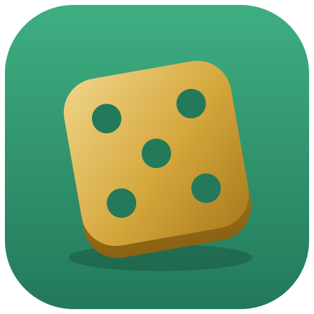
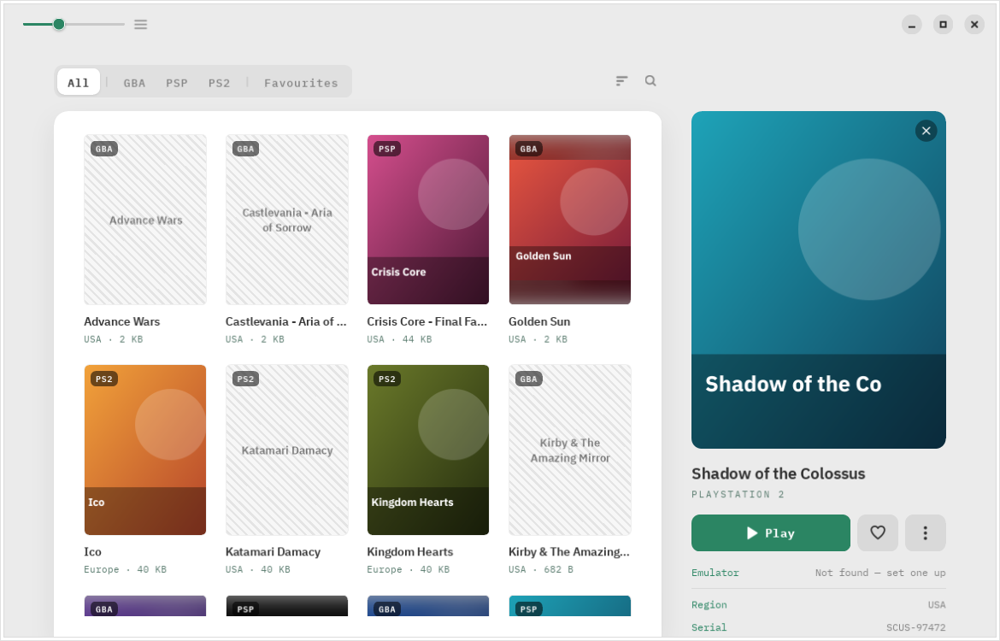
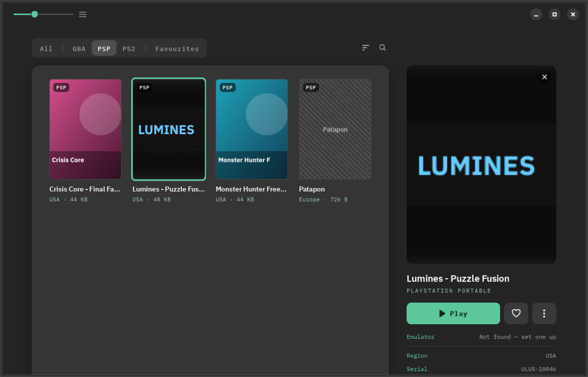

<p align="center">
  
</p>

<h1 align="center">Dice</h1>

<p align="center">
  A calm library for your emulator games on GNOME —<br>
  point it at your ROM folder, pick a game, press Play.
</p>

<p align="center">
  
</p>

Dice keeps the ROMs you already own in one tidy shelf. Add a folder and it
finds every game inside — sub-folders included — works out which system each
one is for, reads what it can from the file itself, and launches it in the
right emulator. It only ever *reads* your folders.

<p align="center">
  
</p>

> The screenshots use a synthetic test library (generated box art), not real games.

## Features

**Your library**
- **A tab per platform** — All, then GBA, PSP, PS2 (only the ones you have), then Favourites
- **Knows what's inside**: GBA cartridge headers (game code, region), PSP
  discs (`PARAM.SFO` title and serial) and PS2 discs (`SYSTEM.CNF` serial) —
  including **CSO**, **BIN/CUE** and **zipped GBA** files. PSP and PS2 `.iso`s
  are told apart by their contents, not their folder
- **Search** by title, serial, region or file name; **sort** by title,
  platform, recently played, recently added or size

**Box art**
- Images named like the ROM, next to it or in a `covers/`, `boxart/`,
  `media/covers/` or `Named_Boxarts/` folder
- The icon **inside PSP discs**
- **Downloaded by name** from the libretro thumbnail archive for anything
  else (can be turned off)
- Or pick any image yourself — a hand-picked cover always wins

**Playing**
- **Finds mGBA, PPSSPP and PCSX2** automatically (Flatpak or native), or
  uses any command you set per platform in Preferences
- Tracks **last played** and **play time**
- Double-click a cover or press <kbd>Enter</kbd> to play

## Adding a platform

Platforms live in one registry, [`src/platforms.py`](src/platforms.py): its
extensions, folder-name hints, libretro name and emulators. Tabs are built
from it, so a platform whose files can be recognised by extension (SNES, N64,
Game Boy…) is a single entry. Disc systems that share `.iso`/`.chd` with
others (PS1, GameCube…) also want a content check in
[`src/romscan.py`](src/romscan.py).

## Install

Grab the latest `.flatpak` bundle from the
[**Releases**](https://github.com/DrVonMiau/roms/releases) page, then:

```sh
flatpak install --user io.github.drvonmiau.Dice.flatpak
flatpak run io.github.drvonmiau.Dice
```

Dice launches emulators installed on your computer (it talks to the host
through `flatpak-spawn`), so install the ones you need too, e.g. from Flathub:
`io.mgba.mGBA`, `org.ppsspp.PPSSPP`, `net.pcsx2.PCSX2`.

## Building from source

Open the project in **GNOME Builder** and press Run, or:

```sh
flatpak-builder --user --install --force-clean _flatpak io.github.drvonmiau.Dice.json
flatpak run io.github.drvonmiau.Dice
```

Tests (no GTK needed):

```sh
python3 -m unittest discover -s tests
```

## Part of a family

Dice is one of four sibling apps that share a design language — the same
calm, offline-first idea recast for different libraries:

- 🎵 [**Lyre**](https://github.com/DrVonMiau/lyre) — your music
- 🖼️ [**Easel**](https://github.com/DrVonMiau/easel) — your photos
- 📖 [**Quill**](https://github.com/DrVonMiau/quill) — your reading
- 🎲 **Dice** — your games *(you are here)*

## Built with

GTK4 · libadwaita · PyGObject, packaged as a Flatpak on the GNOME runtime.

## License

Dice is free software, released under the [GNU GPL 3.0 or later](COPYING).
